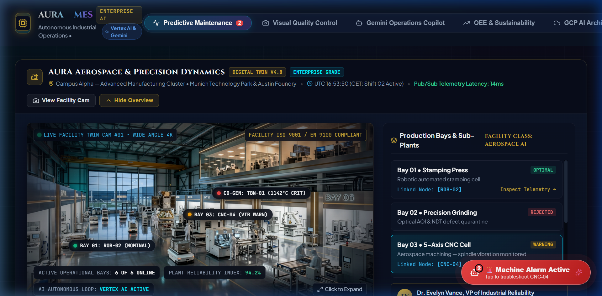
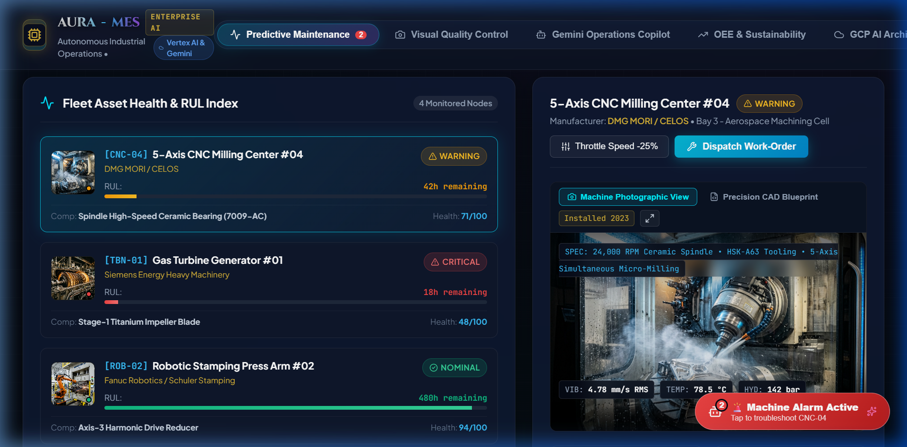
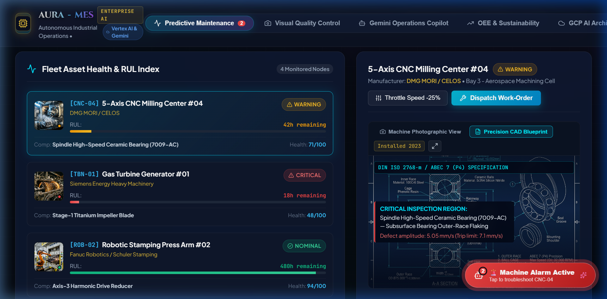
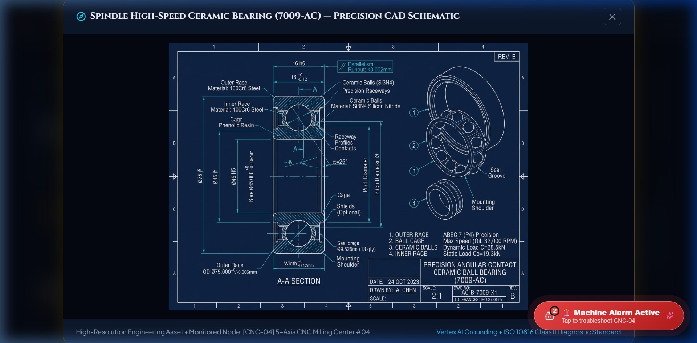
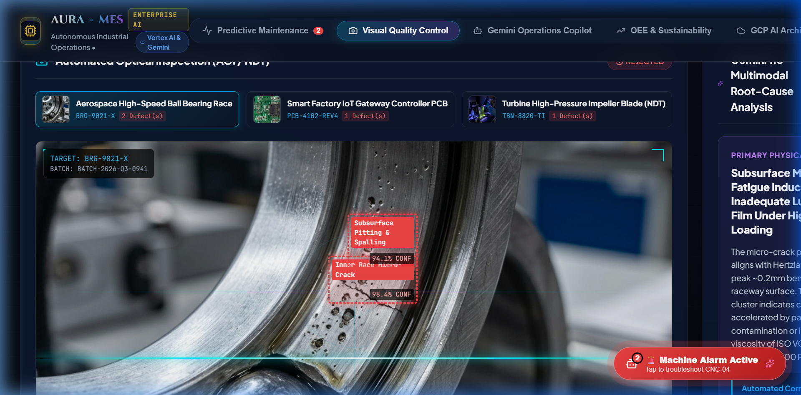
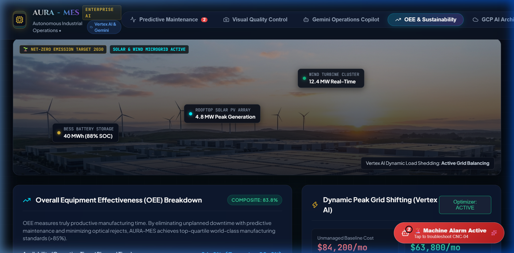
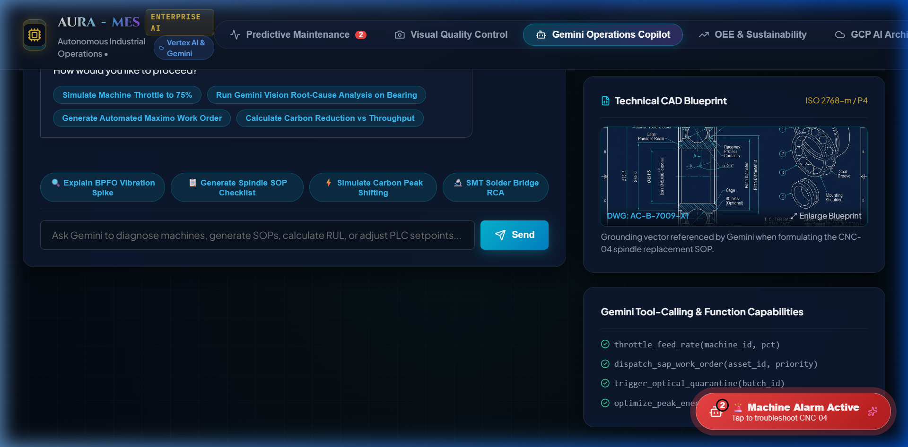
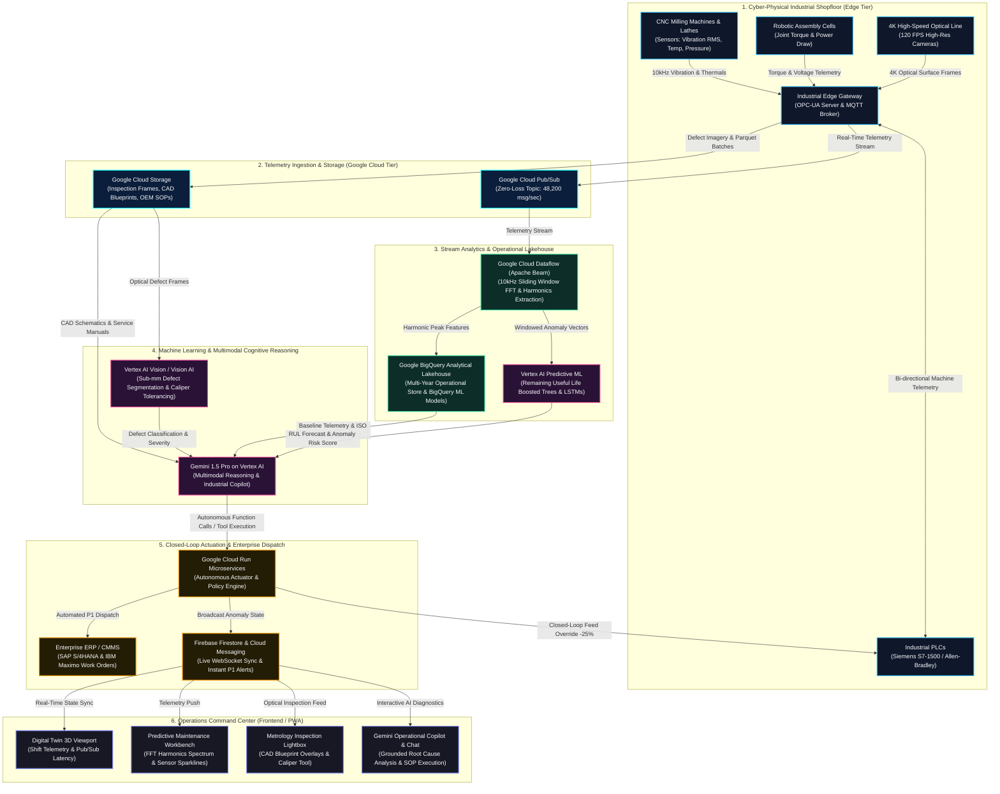
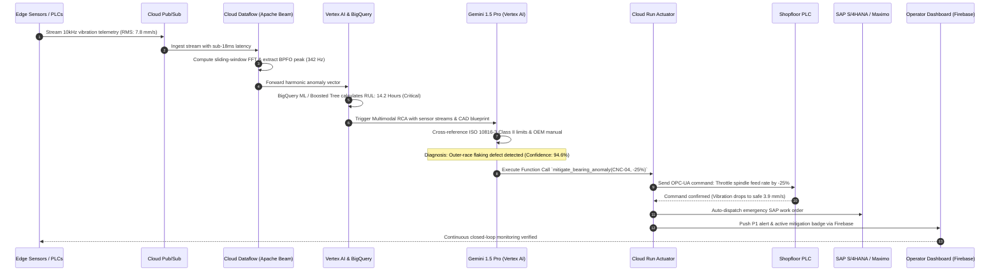

# AURA-MES: Autonomous Industrial Operations & Intelligent Efficiency Platform
**Powered by Google Cloud Vertex AI & Gemini Multi-Modal**

An enterprise-grade smart manufacturing operations platform designed to address industrial challenges in **reliability, quality, efficiency, and sustainability**.

---

## 🌟 Live Demo & Quick Start

🚀 **Production Live Demo:**  
👉 **[https://optimal-buffer-499617-h2.web.app](https://optimal-buffer-499617-h2.web.app)**  
*(Alternate domain: [https://optimal-buffer-499617-h2.firebaseapp.com](https://optimal-buffer-499617-h2.firebaseapp.com))*

Local development server:
👉 **`http://localhost:5173/`**

### Running Locally:
```bash
# Install dependencies
npm install

# Start local development server
npm run dev
```

---

## 📸 Visual Interface & Operational Snapshots

### 1. Smart Factory Digital Twin & Executive Facility Showcase
> 4K plant floor viewport with interactive floor telemetry hotspots, operational bay selector, and real-time Shift & Pub/Sub latency monitoring.



### 2. Fleet Machinery Photographic Workbench
> Real equipment photographs, live sensor telemetry sparklines, and manufacturer specification overlays.



### 3. Precision CAD Engineering Blueprint & Defect Callout
> High-precision technical CAD cross-section schematic with defect region callouts and DIN ISO 2768-m / ABEC 7 tolerance limits.



### 4. Fullscreen Metrology Lightbox Zoom Modal
> High-resolution inspection lightbox for analyzing mechanical bearing raceways and machinery components.



### 5. Multimodal Visual Quality Control & Optical Reticle Caliper
> High-speed automated optical inspection with sub-millimeter bounding box segmentation, reticle caliper overlay, and batch defect thumbnails.



### 6. Sustainable Campus Solar & Wind Microgrid
> Net-zero factory campus with floating real-time microgrid generation telemetry for rooftop solar PV, wind turbine cluster, and BESS storage.



### 7. Gemini 1.5 Pro Operational Copilot with Technical Grounding
> Conversational reasoning assistant grounded in real-time sensor streams and technical engineering blueprints.



---

## 📐 System Architecture & End-to-End Dataflow Diagram

The platform integrates physical shopfloor machinery with Google Cloud intelligence to enable autonomous closed-loop predictive maintenance and real-time optical quality inspection.

### 1. High-Level Architecture & Data Pipeline



---

### 2. Autonomous Closed-Loop Incident Response Flow

The sequence below illustrates how an anomalous vibration spike on a CNC spindle is autonomously ingested, diagnosed, and mitigated without unplanned shopfloor downtime:



---

## 🏭 Core Solution Capabilities

### 1. Fleet Predictive Maintenance & RUL Estimation
- **Multi-Sensor Telemetry**: Live ingestion of vibration velocity (RMS), temperature, hydraulic pressure, acoustic emission (dB), and power draw.
- **Dataflow FFT Harmonics**: Real-time Fast Fourier Transform breakdown isolating defect harmonic peaks (BPFO outer race, BPFI inner race).
- **BigQuery ML Remaining Useful Life (RUL)**: Boosted Tree regression estimating operational hours remaining before failure.
- **Closed-Loop Intervention**: One-click PLC feed-rate throttling (-25%) and automated SAP/Maximo work order dispatch.

### 2. Multimodal Visual Quality Control (AOI / NDT)
- **High-Resolution Optical Inspection**: Live scanning line inspecting manufactured aerospace bearings, IoT gateway PCBs, and titanium turbine blades.
- **Defect Segmentation**: Bounding boxes with sub-millimeter metrology tolerances and confidence scoring.
- **Gemini 1.5 Multimodal RCA**: Autonomous diagnosis linking surface anomalies to physical root causes (e.g. lubrication breakdown, stencil aperture smear, thermal fatigue).

### 3. Gemini 1.5 Pro Operational Copilot
- Conversational industrial assistant grounded on live OPC-UA telemetry, OEM service manuals, and ISO 10816 standards.
- Executable tool calls: machine parameter overrides, SOP checklist generation, and maintenance dispatching.

### 4. Floating Plant Issue Support Chatbot (Global Widget)
- **Always-Accessible**: Persistent bottom-right floating AI widget available across every view in the application.
- **Proactive Alarm Detection**: Automatically pulses red with an issue badge whenever machine anomalies occur (e.g., CNC-04 vibration spike).
- **Direct Operational Actuation**: One-click actions directly in the chat to throttle spindle feed rates via Cloud Run, create emergency SAP/Maximo work orders, or navigate to diagnostic tools.
- **SOP Manuals & RCA**: Instant step-by-step Standard Operating Procedures (bearing replacement, lubrication specifications, torque preloads) and optical quality diagnostics.

### 5. OEE & Decarbonization Engine
- **OEE Waterfall Decomposition**: Availability (94.2%), Performance (89.6%), Quality (99.2%) yielding **83.8% Composite OEE**.
- **Dynamic Peak Grid Shifting**: Vertex AI schedule optimization shifting high-energy thermal cycles to renewable energy windows, saving **$20,400/month** and avoiding **18.6 Metric Tons of CO₂**.
- **Scrap Reduction**: Optical quarantine cuts scrap rate from **4.2% down to 0.8%**.

### 5. Suggested Google Cloud Technologies Implementation
- **Gemini on Vertex AI**: **Reasoning and operational assistance** — Correlates 10kHz vibration signals, 4K camera inspection frames from Cloud Storage, and OEM PDF service manuals to determine physical failure modes and autonomously trigger corrective actions via function calling.
- **Vertex AI**: **Predictive and machine-learning workloads** — Continuous Remaining Useful Life (RUL) regression (Boosted Trees & LSTMs) and multivariate anomaly probability scoring across rotating plant machinery.
- **BigQuery**: **Sensor and operational data analysis** — Petabyte-scale telemetry lakehouse storing raw sensor streams, batch cycle times, and maintenance logs with in-database BigQuery ML models for degradation trends.
- **Cloud Storage**: **Images, sensor data, and files** — High-durability (11 9's) object storage archiving 4K optical camera frames, raw 10kHz sensor parquet files, CAD models, and OEM equipment manuals with automated lifecycle tiering.
- **Vision AI / Vertex AI Vision**: **Image/video analysis capabilities where relevant** — High-speed (120 FPS) automated optical inspection (AOI) detecting surface spalling, micro-cracks, and dimensional anomalies.
- **Pub/Sub**: **Streaming or event-driven data** — Zero-loss ingestion capturing 48,200 telemetry messages/sec from shopfloor OPC-UA gateways, MQTT brokers, and machine vision triggers.
- **Dataflow**: **Data pipelines** — Serverless Apache Beam stream processing computing sliding-window aggregations and Fast Fourier Transform (FFT) harmonic extractions with sub-18ms latency.
- **Cloud Run**: **Application and processing services** — Containerized FastAPI microservices executing closed-loop PLC feed rate overrides via OPC-UA/Modbus, Eventarc triggers, and SAP/Maximo work order creation.
- **Firebase & Cloud Firestore**: **Client & Live State Sync** — Real-time WebSocket state propagation (`onSnapshot`) to operator screens and instant P1 alerts via Firebase Cloud Messaging (FCM).

---

## 📁 Project Structure

```
├── index.html                   # HTML entry point with fonts & metadata
├── src/
│   ├── main.jsx                 # React root renderer
│   ├── App.jsx                  # Main application state & simulation manager
│   ├── index.css                # Dark industrial cyber-physical design system
│   ├── data/
│   │   └── mockFactoryData.js   # Telemetry, vision datasets & GCP architectures
│   └── components/
│       ├── Header.jsx           # Top nav, live stream badge & simulation bar
│       ├── MetricCards.jsx       # OEE, scrap rate, and savings KPI strip
│       ├── PredictiveMaintenanceView.jsx # Live telemetry, FFT spectrum & RUL
│       ├── VisualInspectionView.jsx      # Optical scanner & Gemini vision RCA
│       ├── CopilotView.jsx               # Gemini 1.5 multimodal chat & tool calls
│       ├── SustainabilityView.jsx        # OEE breakdown & peak grid shifting
│       └── CloudArchitectureView.jsx     # Interactive GCP architecture blueprint
└── public/
    └── assets/
        └── inspection/          # High-resolution industrial macro assets
            ├── bearing_defect.jpg
            ├── pcb_defect.jpg
            └── turbine_crack.jpg
```
